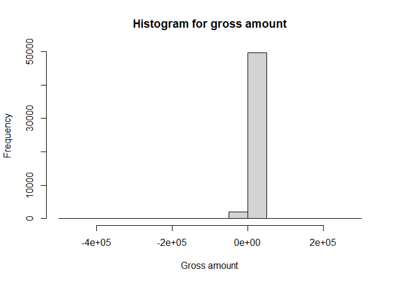
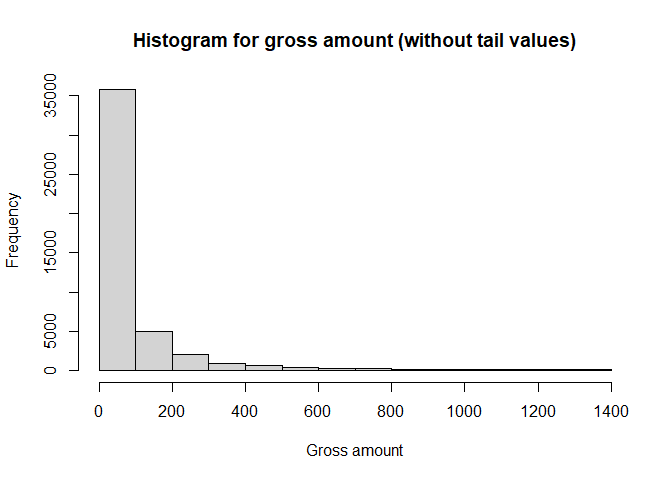
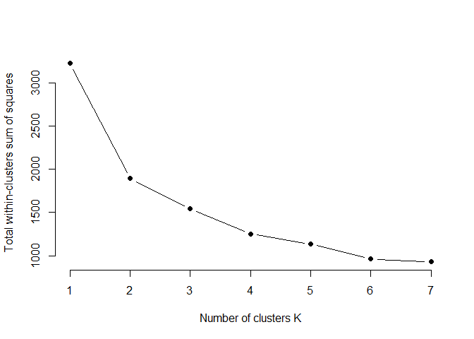
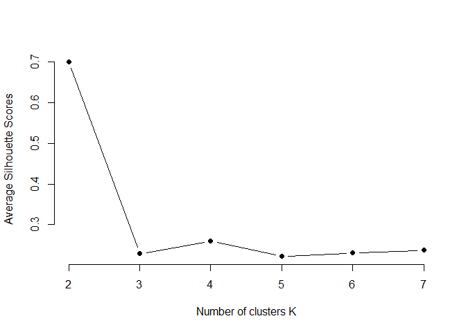
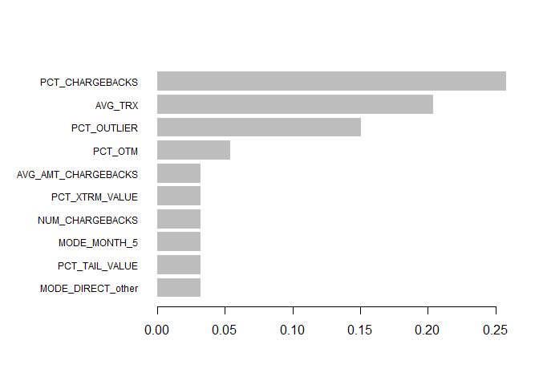
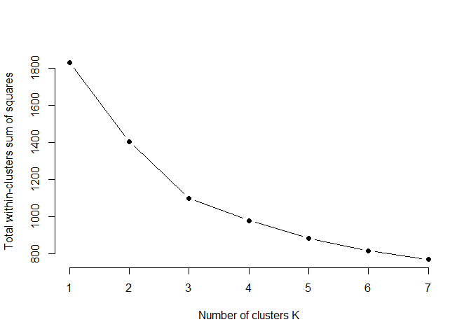
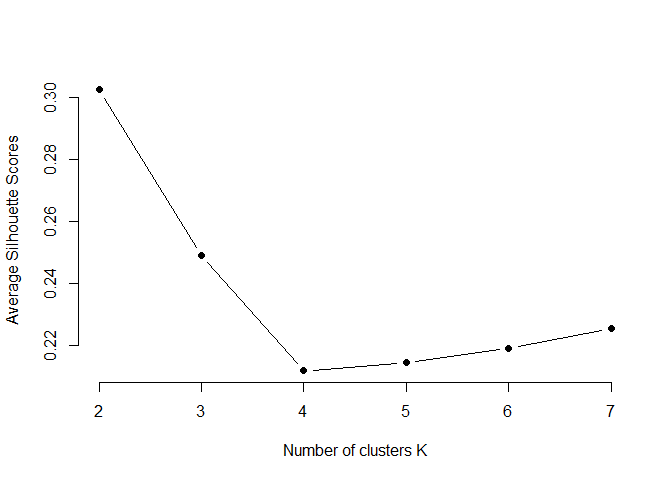
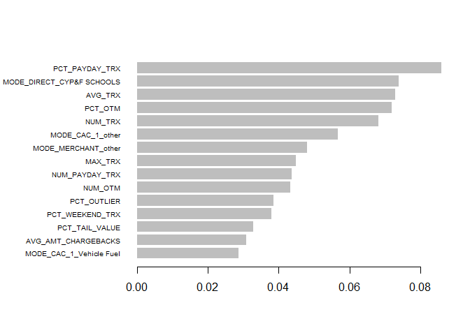

------------------------------------------------------------------------

> This report is just for assessment purposes

*by Fernando Cortés Tejada* \|
[linkedin](https://www.linkedin.com/in/fernando-cortes-tejada/) \|
[github](https://github.com/fcortes10)

# Purchase Card Transactions

We have a collection of purchase card transactions for the Birmingham
City Council. This is a historical open source dataset and can be found
in this
[link](https://data.birmingham.gov.uk/dataset/purchase-card-transactions).

The aim of this analysis is to **discover profiles** or **unusual
transactions**. In Data Science language this can be read as clustering
and anomalies detection problems.

The card transactions data starts in April 2014 and ends in January
2018. We want to use the most recent complete year for the analysis so
we chose the whole 2017 year. When looking at the raw data, December
2017 file has different type of data, so the file might be wrong. We
switched to December 2016 to November 2017.

We chose to approach this problem with `R` instead of `python` because
the most robust method for clustering when you have different data
types, e.g. numerical, logical, categorical and ordinal, is Gower’s
distance and is not yet well implemented in a python package. The
mathematical definition of this distance can be found
[here](https://statisticaloddsandends.wordpress.com/2021/02/23/what-is-gowers-distance/).

------------------------------------------------------------------------

## Index

1.  [Data reading](#data-reading)  
2.  [Data cleaning](#data-cleaning)  
3.  [Data exploration](#data-exploration)
4.  [Feature engineering](#feature-engineering)
    -   [Transaction level](#transaction-level)
    -   [Client level](#client-level)  
5.  [Clustering and anomalies
    detection](#clustering-and-anomalies-detection)
    -   [Number of clusters (K)](#number-of-clusters-k)  
    -   [Clustering](#clustering)  
    -   [Anomalies detection](#anomalies-detection)  
    -   [New number of clusters (K)](#new-number-of-clusters-k)  
    -   [New clustering](#new-clustering)  
6.  [Interpretation and conclusions](#interpretation-and-conclusions)

------------------------------------------------------------------------

## Let’s get started

We begin by setting some global configurations and loading required
packages. For installing the ones you don’t have run
`install.packages("package-name")` in the R console.

``` r
Sys.setlocale("LC_TIME", "C")

library(knitr)
library(data.table)
library(plyr)
library(readr)
library(stringr)
library(dplyr)
library(ggQC)
library(fastDummies)
library(cluster)
library(factoextra)
library(purrr)
library(mclust)
library(xgboost)
```

([back to index](#index))

------------------------------------------------------------------------

### Data reading

Then we read the data structure, get all files from the `data-csv`
folder, also
[here](https://github.com/fcortes10/purchases-clustering/tree/main/data-csv),
standardize column names and append all datasets into a big one called
`dt`.

``` r
#reading structure from data
dt <- fread('data-csv/purchase-card-transactions-201612.csv', nrows = 0)

#getting file names
files <- list.files('data-csv', pattern = '..csv', full.names = TRUE)

#standardizing column names: no spaces and uppercase
column.names <- toupper(gsub(" ", "_", colnames(dt)))

#read all files and store them in a list
list.dt <- lapply(files, fread, select = colnames(dt), col.names = column.names)

#collapse all elements in one data.table
dt <- as.data.table(ldply(list.dt, data.frame))

#remove unnecessary/remaining environment variables and cleaning garbage in RAM
rm(list.dt, files, column.names)
gc()
```

Now we can have an overview of how the dataset looks like (just the 3
first rows)

``` r
head(dt, 3)
```

    ##    TRANS_DATE TRANS_VAT_DESC ORIGINAL_GROSS_AMT      MERCHANT_NAME
    ## 1:   22/12/16             VR              20.00    shell kings 587
    ## 2:   15/12/16             VR              35.00    shell kings 587
    ## 3:   22/12/16             VR              75.97 shell fiveways 387
    ##         CARD_NUMBER TRANS_CAC_CODE_1 TRANS_CAC_DESC_1 TRANS_CAC_CODE_2
    ## 1: ************5770             K020     Vehicle Fuel            RV12N
    ## 2: ************5770             K020     Vehicle Fuel            RV12N
    ## 3: ************1147             K020     Vehicle Fuel            RV1K2
    ##           TRANS_CAC_DESC_2 TRANS_CAC_CODE_3         DIRECTORATE
    ## 1:    African-Caribbean DC              A00 Adult & Communities
    ## 2:    African-Caribbean DC              A00 Adult & Communities
    ## 3: Elders Group - Ladywood              A00 Adult & Communities

([back to index](#index))

------------------------------------------------------------------------

### Data cleaning

We apply some treatments to data in order to make it more handleable.
This includes, converting data types, changing formats, dropping
columns, cleaning missing values, etc.

``` r
#data cleaning
#extract just the numeric part from the card number as key (leaving it as string)
dt[ , CARD_NUMBER := str_pad(parse_number(dt[ , CARD_NUMBER]), width = 4, side = 'left', pad = "0")]

#transform the transaction date from string to date format
dt[ , TRANS_DATE := as.Date(dt[ , TRANS_DATE], format = "%d/%m/%y")]

#dropping transaction codes because we are keeping the description
dt[ , c("TRANS_CAC_CODE_1", "TRANS_CAC_CODE_2", "TRANS_CAC_CODE_3") := NULL]

#dropping TRANS_VAT_DESC because there is not metadata and we cannot infer its meaning
dt[ , TRANS_VAT_DESC := NULL]
```

We get a brief summary of the data to see any pattern or issue

``` r
summary(dt)
```

    ##    TRANS_DATE         ORIGINAL_GROSS_AMT MERCHANT_NAME      CARD_NUMBER       
    ##  Min.   :2016-10-25   Length:51592       Length:51592       Length:51592      
    ##  1st Qu.:2017-03-08   Class :character   Class :character   Class :character  
    ##  Median :2017-06-09   Mode  :character   Mode  :character   Mode  :character  
    ##  Mean   :2017-06-07                                                           
    ##  3rd Qu.:2017-09-13                                                           
    ##  Max.   :2017-12-01                                                           
    ##  NA's   :1                                                                    
    ##  TRANS_CAC_DESC_1   TRANS_CAC_DESC_2   DIRECTORATE       
    ##  Length:51592       Length:51592       Length:51592      
    ##  Class :character   Class :character   Class :character  
    ##  Mode  :character   Mode  :character   Mode  :character  
    ##                                                          
    ##                                                          
    ##                                                          
    ## 

The first variable we can see is `TRANS_DATE`, which has only one `NA`,
so we remove it.

``` r
dt <- dt[!is.na(TRANS_DATE)]
```

We also see that `ORIGINAL_GROSS_AMT` is a character column when it must
be numeric. We cast it as numeric.

``` r
head(as.numeric(dt[ , ORIGINAL_GROSS_AMT]))
```

    ## Warning in head(as.numeric(dt[, ORIGINAL_GROSS_AMT])): NAs introducidos por
    ## coerción

    ## [1] 20.00 35.00 75.97 50.00 47.24 76.45

where we get a warning of induced `NAs`, so something must be happening.
Checking the `NAs`

``` r
head(dt[which(is.na(as.numeric(dt[ , ORIGINAL_GROSS_AMT])))], 3)
```

    ## Warning in which(is.na(as.numeric(dt[, ORIGINAL_GROSS_AMT]))): NAs introducidos
    ## por coerción

    ##    TRANS_DATE ORIGINAL_GROSS_AMT          MERCHANT_NAME CARD_NUMBER
    ## 1: 2016-12-19          61,206.88 the furnishing service        6583
    ## 2: 2016-12-19          39,520.09 the furnishing service        6583
    ## 3: 2016-12-19          45,585.13 the furnishing service        6583
    ##     TRANS_CAC_DESC_1 TRANS_CAC_DESC_2         DIRECTORATE
    ## 1: Equip Operational      Social Fund Corporate Resources
    ## 2: Equip Operational      Social Fund Corporate Resources
    ## 3: Equip Operational      Social Fund Corporate Resources

we can see it is the thousands separator. So we replace the character
`","` in the string and cast again.

``` r
#it is the thousands separator, we replace it and cast again as numeric
dt[ , ORIGINAL_GROSS_AMT := as.numeric(gsub(",", "", ORIGINAL_GROSS_AMT))]
```

([back to index](#index))

------------------------------------------------------------------------

### Data exploration

For the data exploration we don’t want pretty charts yet, just see how
the data looks. We start with out only numeric column
`ORIGINAL_GROSS_AMT`. To explore a univariate numeric variable, the
simplest way is plotting a histogram:

``` r
hist(dt[ , ORIGINAL_GROSS_AMT], main = "Histogram for gross amount", xlab = "Gross amount")
```

<!-- -->

where we see that we got outliers that doesn’t let us see clearly our
data. So we limit our graph to be between the quantiles 5% and 95%

``` r
ext_q <- quantile(dt[ , ORIGINAL_GROSS_AMT], probs = c(0.05, 0.95))
hist(dt[between(ORIGINAL_GROSS_AMT, ext_q[1], ext_q[2]), ORIGINAL_GROSS_AMT], 
     main = "Histogram for gross amount (without tail values)", xlab = "Gross amount")
```

<!-- -->

We can see a right skewed distribution, similar to a decaying
exponential.

Now we will explore the categorical columns by checking the number of
distinct values in each variable.

``` r
#we declare a function for unique values
f <- function(x){
  length(unique(x))
}

#we apply the function to the margin 2 (columns)
apply(dt, MARGIN = 2, f)
```

    ##         TRANS_DATE ORIGINAL_GROSS_AMT      MERCHANT_NAME        CARD_NUMBER 
    ##                370              18083               6268               1028 
    ##   TRANS_CAC_DESC_1   TRANS_CAC_DESC_2        DIRECTORATE 
    ##                125                888                 13

We see that we have:

-   `370` distinct days with transactions
-   `18,083` distinct monetary amounts in transactions
-   `6,268` distinct merchant
-   `1,028` distinct card numbers (and we can assume `1,028` distinct
    clients)
-   `125` distinct type of business according to `DESC_1`
-   `888` distinct type of business according to `DESC_2`
-   `13` distinct type of business according to `DIRECTORATE`

We start with `TRANS_CAC_DESC_2` and show the 20 most frequent
categories:

``` r
head(dt[ , .N, TRANS_CAC_DESC_2][order(N, decreasing = TRUE)], 20)
```

    ##                             TRANS_CAC_DESC_2    N
    ##  1:            Homeless Private Sector Accom 4987
    ##  2:   Illegal Money Lending T Stds Comm Inv. 2957
    ##  3:            The City of Birmingham School 1386
    ##  4:                      Camborne House HLDC  871
    ##  5:                           Technical Unit  779
    ##  6:                       West Heath Primary  564
    ##  7:     St Barnabas CE Junior & Infant  (NC)  510
    ##  8:                               Bloomsbury  472
    ##  9:           Ward End Junior & Infant  (NC)  462
    ## 10:                              Baskerville  453
    ## 11:              16+ Accommodation & Support  409
    ## 12:     Warwick Hse HLDC, 938 Warwick Rd B27  402
    ## 13:        Regents Park Junior & Infant (NC)  396
    ## 14:                      Harper Bell Primary  393
    ## 15:                 Selly Oak Nursery School  379
    ## 16:              St Edmund Campion Secondary  336
    ## 17:          Raddlebarn Junior & Infant (NC)  330
    ## 18:                        Corp Inbound Post  311
    ## 19:                                 Uffculme  309
    ## 20: International School & Community College  306

where we can see that it is somehow related to institutions or schools
but since we got no metadata and the are 88 categories we chose to drop
it.

``` r
dt[ , TRANS_CAC_DESC_2 := NULL]
```

Then, we continue with the 20 most frequent `MERCHANT_NAME`

``` r
head(dt[ , .N, MERCHANT_NAME][order(N, decreasing = TRUE)], 20)
```

    ##                 MERCHANT_NAME    N
    ##  1:     amazon uk marketplace 5153
    ##  2:         travelodge gb0000 4890
    ##  3:          amazon uk retail 1388
    ##  4: amazon uk retail amazon.c 1038
    ##  5:        asda home shopping  962
    ##  6: amazon svcs eu-uk amazon.  641
    ##  7:              amazon.co.uk  627
    ##  8:       post office counter  585
    ##  9:           asda superstore  456
    ## 10:        argos retail group  380
    ## 11:      rontec weoley castle  367
    ## 12:         js online grocery  364
    ## 13:        bcc register offic  357
    ## 14:          texaco ash motor  308
    ## 15:           www.argos.co.uk  307
    ## 16:         esso aston way ss  305
    ## 17:              mrh six ways  283
    ## 18:         rontec longbridge  260
    ## 19:         sainsburys s/mkts  251
    ## 20:    amazon eu amazon.co.uk  244

where we see that amazon has more than 5 variations in its name, so we
group it

``` r
dt[grepl('amazon', tolower(dt[ , MERCHANT_NAME])), MERCHANT_NAME := 'amazon']
```

and we do the same for other similar cases.

``` r
dt[grepl('asda', tolower(dt[ , MERCHANT_NAME])), MERCHANT_NAME := 'asda']
dt[grepl('travelodge', tolower(dt[ , MERCHANT_NAME])), MERCHANT_NAME := 'travelodge']
dt[grepl('argos', tolower(dt[ , MERCHANT_NAME])), MERCHANT_NAME := 'argos']
```

We just keep the common merchants and everything else is grouped in a
bag to reduce categories.

``` r
head(dt[ , .N, MERCHANT_NAME][order(N, decreasing = TRUE)], 10)
```

    ##            MERCHANT_NAME    N
    ##  1:               amazon 9421
    ##  2:           travelodge 4990
    ##  3:                 asda 1736
    ##  4:                argos  961
    ##  5:  post office counter  585
    ##  6: rontec weoley castle  367
    ##  7:    js online grocery  364
    ##  8:   bcc register offic  357
    ##  9:     texaco ash motor  308
    ## 10:    esso aston way ss  305

``` r
common.merchants <- c('amazon', 'travelodge', 'asda', 'argos', 'post office counter')
dt[!dt[ , MERCHANT_NAME] %in% common.merchants, MERCHANT_NAME := 'other']
```

We do the same for `TRANS_CAC_DESC_1` and `DIRECTORATE` but we define a
threshold of 5% not to put the category in a bag.

``` r
#we show the 20 most frequent desc 1
head(dt[ , .N, TRANS_CAC_DESC_1][order(N, decreasing = TRUE)], 20)
```

    ##            TRANS_CAC_DESC_1     N
    ##  1:       Equip Operational 10209
    ##  2:            Vehicle Fuel  5560
    ##  3:          Purchases Food  5006
    ##  4:     Other Third Parties  4926
    ##  5:      Supplies & Sev Mic  2799
    ##  6:                   Books  2555
    ##  7:          Mat'l Raw/Drct  1720
    ##  8: Conference Fees Subs UK  1549
    ##  9:             Equip Other  1481
    ## 10:    Bldg RM Departmental  1078
    ## 11:              Stationery  1047
    ## 12:             Hospitality  1023
    ## 13:         Prof Fees other   989
    ## 14:         Travel Bus/Rail   842
    ## 15:                 Postage   797
    ## 16:    Phon NonCentrx Lines   720
    ## 17:         Computing Other   674
    ## 18:             Electricity   645
    ## 19:      Other Fix&Fittings   623
    ## 20:     Vehicle OthrunCosts   564

``` r
#we keep the groups with more than 5% of total transactions and the rest is grouped in a bag
(gt5pct <- dt[ , .N, TRANS_CAC_DESC_1][order(N, decreasing = TRUE)][N > 0.05*nrow(dt), ][ , TRANS_CAC_DESC_1])
```

    ## [1] "Equip Operational"   "Vehicle Fuel"        "Purchases Food"     
    ## [4] "Other Third Parties" "Supplies & Sev Mic"

``` r
dt[!dt[ , TRANS_CAC_DESC_1] %in% gt5pct, TRANS_CAC_DESC_1 := 'other']
```

``` r
#we show the 10 most frequent directorate
dt[ , DIRECTORATE := toupper(DIRECTORATE)]
head(dt[ , .N, DIRECTORATE][order(N, decreasing = TRUE)], 10)
```

    ##                      DIRECTORATE     N
    ##  1:                CYP&F SCHOOLS 24139
    ##  2:               LOCAL SERVICES 14162
    ##  3:                        CYP&F  5607
    ##  4:          CORPORATE RESOURCES  3962
    ##  5:          ADULT & COMMUNITIES  1942
    ##  6:                         #N/D   738
    ##  7:                  DEVELOPMENT   663
    ##  8: ADULT SOCIAL CARE AND HEALTH   368
    ##  9:                       ADULTS     6
    ## 10:                        CYO&F     4

``` r
#we keep the groups with more than 5% of total transactions and the rest is grouped in a bag
(gt5pct <- dt[ , .N, DIRECTORATE][order(N, decreasing = TRUE)][N > 0.05*nrow(dt), ][ , DIRECTORATE])
```

    ## [1] "CYP&F SCHOOLS"       "LOCAL SERVICES"      "CYP&F"              
    ## [4] "CORPORATE RESOURCES"

``` r
dt[!dt[ , DIRECTORATE] %in% gt5pct, DIRECTORATE := 'other']
head(dt[ , .N, DIRECTORATE][order(N, decreasing = TRUE)], 10)
```

    ##            DIRECTORATE     N
    ## 1:       CYP&F SCHOOLS 24139
    ## 2:      LOCAL SERVICES 14162
    ## 3:               CYP&F  5607
    ## 4: CORPORATE RESOURCES  3962
    ## 5:               other  3721

([back to index](#index))

------------------------------------------------------------------------

### Feature engineering

We have divided the feature engineering in two groups: transaction level
and client level.

#### Transaction level

We just have 6 columns and one is the key column (card\_number) so just
5 features. Thus, we need to create more features in order to make
clusters and find profiles.

Let’s begin by extracting the day, weekday and month as variables.

``` r
#extract the day as a variable
dt[ , DAY := as.numeric(substr(x = TRANS_DATE, start = 9, stop = 10))]

#extract the weekday as a variable
dt[ , WEEKDAY := weekdays(dt[ , TRANS_DATE])]

#extract the months as a variable
dt[ , MONTH := as.numeric(substr(x = TRANS_DATE, start = 6, stop = 7))]
```

We create the `CHARGEBACK` feature, which tells us if the transaction
amount is negative (a return)

``` r
#chargebacks
dt[ , CHARGEBACK := ifelse(ORIGINAL_GROSS_AMT < 0, 1, 0)]
```

and with that we change all amounts to positive.

``` r
#amounts to positive
dt[ , POSITIVE_AMT := ifelse(CHARGEBACK == 1, -1*ORIGINAL_GROSS_AMT, ORIGINAL_GROSS_AMT)]
```

We also create binary features that indicate us if the transaction
amount is an outlier, an extreme value, is a tail value or is over the
median.

``` r
#outliers
iqr <- quantile(dt[ , POSITIVE_AMT], probs = c(0.25, 0.75))
dt[ , OUTLIER := ifelse(!between(POSITIVE_AMT, iqr[1]-1.5*QCrange(iqr), iqr[2]+1.5*QCrange(iqr)), 1, 0)]

#extreme values
dt[ , EXTREME_VALUE := ifelse(!between(POSITIVE_AMT, iqr[1]-3*QCrange(iqr), iqr[2]+3*QCrange(iqr)), 1, 0)]

#tail values
tails <- quantile(dt[ , POSITIVE_AMT], probs = c(0.025, 0.975))
dt[ , TAIL_VALUE := ifelse(!between(POSITIVE_AMT, tails[1], tails[2]), 1, 0)]

#over the median (otm)
median.value <- median(dt[ , POSITIVE_AMT])
dt[ , OTM := ifelse(POSITIVE_AMT > median.value, 1, 0)]
```

Now we create two more binary features related to transactions made
around the payday or on weekends.

``` r
#transactions around payday
paydays <- c(1, 2, 14, 15, 16, 28, 29, 30, 31)
dt[ , PAYDAY_TRX := ifelse(DAY %in% paydays, 1, 0)]

#transactions on weekends
weekend.days <- c('Saturday', 'Sunday')
dt[ , WEEKEND_TRX := ifelse(WEEKDAY %in% weekend.days, 1, 0)]
```

We see a summary with the new features.

``` r
summary(dt)
```

    ##    TRANS_DATE         ORIGINAL_GROSS_AMT  MERCHANT_NAME      CARD_NUMBER       
    ##  Min.   :2016-10-25   Min.   :-486980.1   Length:51591       Length:51591      
    ##  1st Qu.:2017-03-08   1st Qu.:     13.2   Class :character   Class :character  
    ##  Median :2017-06-09   Median :     42.9   Mode  :character   Mode  :character  
    ##  Mean   :2017-06-07   Mean   :    212.7                                        
    ##  3rd Qu.:2017-09-13   3rd Qu.:    104.8                                        
    ##  Max.   :2017-12-01   Max.   : 280102.2                                        
    ##  TRANS_CAC_DESC_1   DIRECTORATE             DAY          WEEKDAY         
    ##  Length:51591       Length:51591       Min.   : 1.00   Length:51591      
    ##  Class :character   Class :character   1st Qu.: 8.00   Class :character  
    ##  Mode  :character   Mode  :character   Median :15.00   Mode  :character  
    ##                                        Mean   :15.31                     
    ##                                        3rd Qu.:22.00                     
    ##                                        Max.   :31.00                     
    ##      MONTH         CHARGEBACK       POSITIVE_AMT         OUTLIER      
    ##  Min.   : 1.00   Min.   :0.00000   Min.   :     0.0   Min.   :0.0000  
    ##  1st Qu.: 3.00   1st Qu.:0.00000   1st Qu.:    15.0   1st Qu.:0.0000  
    ##  Median : 6.00   Median :0.00000   Median :    47.0   Median :0.0000  
    ##  Mean   : 6.43   Mean   :0.03923   Mean   :   265.7   Mean   :0.1419  
    ##  3rd Qu.:10.00   3rd Qu.:0.00000   3rd Qu.:   118.0   3rd Qu.:0.0000  
    ##  Max.   :12.00   Max.   :1.00000   Max.   :486980.1   Max.   :1.0000  
    ##  EXTREME_VALUE      TAIL_VALUE           OTM           PAYDAY_TRX    
    ##  Min.   :0.0000   Min.   :0.00000   Min.   :0.0000   Min.   :0.0000  
    ##  1st Qu.:0.0000   1st Qu.:0.00000   1st Qu.:0.0000   1st Qu.:0.0000  
    ##  Median :0.0000   Median :0.00000   Median :0.0000   Median :0.0000  
    ##  Mean   :0.1084   Mean   :0.04987   Mean   :0.4994   Mean   :0.2407  
    ##  3rd Qu.:0.0000   3rd Qu.:0.00000   3rd Qu.:1.0000   3rd Qu.:0.0000  
    ##  Max.   :1.0000   Max.   :1.00000   Max.   :1.0000   Max.   :1.0000  
    ##   WEEKEND_TRX     
    ##  Min.   :0.00000  
    ##  1st Qu.:0.00000  
    ##  Median :0.00000  
    ##  Mean   :0.05956  
    ##  3rd Qu.:0.00000  
    ##  Max.   :1.00000

([back to index](#index))

#### Client level

Based on what we have just engineered at the transaction level, we begin
to create features by grouping the information by client.

First, we need to create dummies from the categorical variables.

``` r
#select columns to make dummies
cols.for.dummy <- c('MERCHANT_NAME', 'TRANS_CAC_DESC_1', 'DIRECTORATE', 'WEEKDAY')
dt.dummies <- dummy_cols(dt, select_columns = cols.for.dummy)
```

Then we start grouping by client and creating new features. These new
features include averages, totals, sums, maximums, percentages, ratios
and modes.

``` r
#declare the statistical mode function (since R doesn't have one)
getmode <- function(x) {
  uniqv <- unique(x)
  uniqv[which.max(tabulate(match(x, uniqv)))]
}

#group by client
dt.grouped <- dt.dummies[ , .(NUM_TRX = .N, AVG_TRX = mean(POSITIVE_AMT), 
                MAX_TRX = max(POSITIVE_AMT), NUM_CHARGEBACKS = sum(CHARGEBACK),
                PCT_CHARGEBACKS = sum(CHARGEBACK)/.N, 
                AVG_AMT_CHARGEBACKS = mean(POSITIVE_AMT*CHARGEBACK),
                PCT_AMT_CHARGEBACKS = sum(POSITIVE_AMT*CHARGEBACK)/sum(POSITIVE_AMT),
                NUM_OUTLIER = sum(OUTLIER), PCT_OUTLIER = sum(OUTLIER)/.N,
                NUM_XTRM_VALUE = sum(EXTREME_VALUE), PCT_XTRM_VALUE = sum(EXTREME_VALUE)/.N,
                NUM_TAIL_VALUE = sum(TAIL_VALUE), PCT_TAIL_VALUE = sum(TAIL_VALUE)/.N,
                NUM_OTM = sum(OTM), PCT_OTM = sum(OTM)/.N, 
                NUM_PAYDAY_TRX = sum(PAYDAY_TRX), PCT_PAYDAY_TRX = sum(PAYDAY_TRX)/.N,
                NUM_WEEKEND_TRX = sum(WEEKEND_TRX), PCT_WEEKEND_TRX = sum(WEEKEND_TRX)/.N,
                MODE_MERCHANT = as.factor(getmode(MERCHANT_NAME)), 
                MODE_CAC_1 = as.factor(getmode(TRANS_CAC_DESC_1)),
                MODE_DIRECT = as.factor(getmode(DIRECTORATE)), 
                MODE_DAY = as.factor(getmode(DAY)), 
                MODE_MONTH = as.factor(getmode(MONTH))), 
                CARD_NUMBER]
```

Finally, we see a summary of the new client-level features.

``` r
summary(dt.grouped)
```

    ##  CARD_NUMBER           NUM_TRX           AVG_TRX            MAX_TRX        
    ##  Length:1028        Min.   :   1.00   Min.   :     0.8   Min.   :     0.8  
    ##  Class :character   1st Qu.:   8.00   1st Qu.:    47.0   1st Qu.:    90.0  
    ##  Mode  :character   Median :  26.00   Median :    66.9   Median :   276.0  
    ##                     Mean   :  50.19   Mean   :   752.0   Mean   :  1584.6  
    ##                     3rd Qu.:  58.25   3rd Qu.:   101.0   3rd Qu.:   500.0  
    ##                     Max.   :1486.00   Max.   :486980.1   Max.   :486980.1  
    ##                                                                            
    ##  NUM_CHARGEBACKS   PCT_CHARGEBACKS   AVG_AMT_CHARGEBACKS PCT_AMT_CHARGEBACKS
    ##  Min.   :  0.000   Min.   :0.00000   Min.   :     0.0    Min.   :0.000000   
    ##  1st Qu.:  0.000   1st Qu.:0.00000   1st Qu.:     0.0    1st Qu.:0.000000   
    ##  Median :  0.000   Median :0.00000   Median :     0.0    Median :0.000000   
    ##  Mean   :  1.969   Mean   :0.05280   Mean   :   637.0    Mean   :0.049113   
    ##  3rd Qu.:  1.000   3rd Qu.:0.02862   3rd Qu.:     0.8    3rd Qu.:0.009714   
    ##  Max.   :234.000   Max.   :1.00000   Max.   :486980.1    Max.   :1.000000   
    ##                                                                             
    ##   NUM_OUTLIER        PCT_OUTLIER       NUM_XTRM_VALUE     PCT_XTRM_VALUE   
    ##  Min.   :   0.000   Min.   :0.000000   Min.   :   0.000   Min.   :0.00000  
    ##  1st Qu.:   0.000   1st Qu.:0.000000   1st Qu.:   0.000   1st Qu.:0.00000  
    ##  Median :   1.000   Median :0.009489   Median :   0.000   Median :0.00000  
    ##  Mean   :   7.121   Mean   :0.089226   Mean   :   5.438   Mean   :0.05314  
    ##  3rd Qu.:   3.000   3rd Qu.:0.075758   3rd Qu.:   1.000   3rd Qu.:0.02332  
    ##  Max.   :1348.000   Max.   :1.000000   Max.   :1271.000   Max.   :1.00000  
    ##                                                                            
    ##  NUM_TAIL_VALUE    PCT_TAIL_VALUE       NUM_OTM           PCT_OTM      
    ##  Min.   :  0.000   Min.   :0.00000   Min.   :   0.00   Min.   :0.0000  
    ##  1st Qu.:  0.000   1st Qu.:0.00000   1st Qu.:   3.00   1st Qu.:0.3058  
    ##  Median :  0.000   Median :0.00000   Median :  12.00   Median :0.4791  
    ##  Mean   :  2.503   Mean   :0.03498   Mean   :  25.06   Mean   :0.5120  
    ##  3rd Qu.:  1.000   3rd Qu.:0.02709   3rd Qu.:  27.00   3rd Qu.:0.7500  
    ##  Max.   :305.000   Max.   :1.00000   Max.   :1485.00   Max.   :1.0000  
    ##                                                                        
    ##  NUM_PAYDAY_TRX   PCT_PAYDAY_TRX   NUM_WEEKEND_TRX   PCT_WEEKEND_TRX  
    ##  Min.   :  0.00   Min.   :0.0000   Min.   :  0.000   Min.   :0.00000  
    ##  1st Qu.:  2.00   1st Qu.:0.1429   1st Qu.:  0.000   1st Qu.:0.00000  
    ##  Median :  6.00   Median :0.2258   Median :  0.000   Median :0.00000  
    ##  Mean   : 12.08   Mean   :0.2303   Mean   :  2.989   Mean   :0.06267  
    ##  3rd Qu.: 14.00   3rd Qu.:0.3000   3rd Qu.:  3.000   3rd Qu.:0.08000  
    ##  Max.   :407.00   Max.   :1.0000   Max.   :108.000   Max.   :1.00000  
    ##                                                                       
    ##              MODE_MERCHANT               MODE_CAC_1               MODE_DIRECT 
    ##  other              :893   Vehicle Fuel       :216   other              :195  
    ##  amazon             : 97   Equip Operational  :155   CYP&F SCHOOLS      :385  
    ##  argos              :  8   Supplies & Sev Mic : 73   CYP&F              :128  
    ##  post office counter:  9   other              :506   CORPORATE RESOURCES: 76  
    ##  asda               : 10   Purchases Food     : 69   LOCAL SERVICES     :244  
    ##  travelodge         : 11   Other Third Parties:  9                            
    ##                                                                               
    ##     MODE_DAY     MODE_MONTH 
    ##  10     : 71   5      :164  
    ##  6      : 70   1      :138  
    ##  9      : 51   11     :138  
    ##  14     : 48   3      : 94  
    ##  20     : 46   7      : 94  
    ##  13     : 46   12     : 87  
    ##  (Other):696   (Other):313

([back to index](#index))

------------------------------------------------------------------------

### Clustering and anomalies detection

Now that we have a lot more features after the feature engineering step,
we begin with out cluster analysis.

#### Number of clusters (K)

First, we have to determine the optimal number of clusters.

Since we have categorical and numerical features, we decided to use
Gower’s distance approach for the distance/dissimilarity matrix.

We begin by storing the key column in a vector and dropping it from the
final dataset.

``` r
#we store the key
key <- dt.grouped[ , CARD_NUMBER]
dt.grouped[ , CARD_NUMBER := NULL]
```

Then we create the distance/dissimilarity matrix.

``` r
#we create a distance/dissimilarity matrix
set.seed(100)
gower_dist <- daisy(as.data.frame(dt.grouped),
                    metric = "gower")
```

There are 3 common methods for determining the number of clusters:

-   Elbow method  
-   Silhouette score  
-   Gap statistic method

but the latter method can’t be performed over a gower distance matrix,
so we will decide with the Elbow and Silhouette methods.

We begin with the Elbow method.

``` r
#elbow method (within-clusters sum of squares)
wss <- function(k, x) {
  kmeans(x = x, k, nstart = 10)$tot.withinss
}

#number of clusters to be tested (from 1 to 7)
k <- 1:7
wss_val <- map_dbl(k, wss, gower_dist)

#plot
plot(k, wss_val, type = "b", pch = 19, frame = FALSE, 
     xlab="Number of clusters K", ylab = "Total within-clusters sum of squares")
```

<!-- -->

This is just a visual method, where the optimal number of clusters is
determined by where the inflection points are located at. In this case
we can see a first inflection point at 2 and then at 4, so those are
going to be our options.

Then we proceed with the Silhouette method.

``` r
#silhouette method 
silhouette_score <- function(k, x){
  km <- kmeans(x = x, centers = k, nstart = 10)
  ss <- silhouette(km$cluster, dist(x))
  mean(ss[ , 3])
}

#number of clusters to be tested (from 2 to 7)
k <- 2:7
avg_sil <- sapply(k, silhouette_score, gower_dist)

#plot
plot(k, avg_sil, type = 'b', pch = 19, frame = FALSE,
     xlab = 'Number of clusters K', ylab = 'Average Silhouette Scores')
```

<!-- -->

In this method, the highest score determines the optimal value of the
number of clusters. So here, we conclude that our first choice must be
`K=2` and as a second choice `K=4`.

([back to index](#index))

#### Clustering

Then, we proceed to use `K=2` and use the K-means algorithm for
clustering.

``` r
set.seed(1)
#kmeans
km <- kmeans(x = gower_dist, centers = 2)

#cluster size
km$size
```

    ## [1]  42 986

``` r
#cluster distribution
prop.table(km$size)
```

    ## [1] 0.04085603 0.95914397

Here we see that we have unbalanced clusters, probably due to anomalies
but we are not sure yet.

In order to know which variables are the most important in determining
the cluster belonging of each client, we train a **supervised model**
with cluster as the target. First we must convert categorical variables
into dummies

``` r
cols.for.dummy.2 <- c('MODE_MERCHANT', 'MODE_CAC_1', 'MODE_DIRECT', 'MODE_DAY', 'MODE_MONTH')
dt.dummies.2 <- dummy_cols(dt.grouped, select_columns = cols.for.dummy.2, remove_selected_columns = TRUE)
```

and we bind the target column, which is the cluster (1 and 2) converted
to 0 and 1 labels.

``` r
dt.sup <- cbind(dt.dummies.2, cluster = km$cluster-1)
```

Then we train a classification model, in this case it is a binary
classification since we have 2 clusters but in order to make it for
general purposes (more than 2 clusters) we train a multinomial xgboost
model. We will not go in much depth on how to build a supervised model
because is out of the scope of this report, but the comments in the code
can work as hints.

``` r
#number of classes
k <- length(km$size)
#definition of the multinomial model
xgb_params <- list("objective" = "multi:softprob",
                   "eval_metric" = "mlogloss",
                   "num_class" = k)
#number of max iterations
nround <- 500 
#number of folds for the cross validation
cv.nfold <- 5

#we declare the train data matrix
train_matrix <- xgb.DMatrix(data = as.matrix(dt.sup[ , -80]), label = dt.sup$cluster)

#we do a cross validation to get the best iteration parameter
set.seed(5)
cv_model <- xgb.cv(params = xgb_params,
                   data = train_matrix, 
                   nrounds = nround,
                   nfold = cv.nfold,
                   verbose = TRUE,
                   prediction = TRUE,
                   early_stopping_rounds = 10)
```

    ## [1]  train-mlogloss:0.440285+0.000297    test-mlogloss:0.443883+0.002023 
    ## Multiple eval metrics are present. Will use test_mlogloss for early stopping.
    ## Will train until test_mlogloss hasn't improved in 10 rounds.
    ## 
    ## [2]  train-mlogloss:0.300202+0.000567    test-mlogloss:0.305790+0.002417 
    ## [3]  train-mlogloss:0.211631+0.000674    test-mlogloss:0.218832+0.003094 
    ## [4]  train-mlogloss:0.152358+0.000673    test-mlogloss:0.160424+0.004252 
    ## [5]  train-mlogloss:0.111178+0.000801    test-mlogloss:0.119874+0.004626 
    ## [6]  train-mlogloss:0.082034+0.000835    test-mlogloss:0.091803+0.004818 
    ## [7]  train-mlogloss:0.060875+0.000745    test-mlogloss:0.071335+0.005521 
    ## [8]  train-mlogloss:0.045549+0.000630    test-mlogloss:0.056578+0.006223 
    ## [9]  train-mlogloss:0.034309+0.000535    test-mlogloss:0.045049+0.006497 
    ## [10] train-mlogloss:0.026182+0.000572    test-mlogloss:0.037654+0.007135 
    ## [11] train-mlogloss:0.020133+0.000501    test-mlogloss:0.031697+0.007285 
    ## [12] train-mlogloss:0.015590+0.000428    test-mlogloss:0.026697+0.007838 
    ## [13] train-mlogloss:0.012225+0.000346    test-mlogloss:0.023300+0.007770 
    ## [14] train-mlogloss:0.009758+0.000336    test-mlogloss:0.021693+0.008443 
    ## [15] train-mlogloss:0.007872+0.000329    test-mlogloss:0.019845+0.008416 
    ## [16] train-mlogloss:0.006468+0.000328    test-mlogloss:0.019041+0.009004 
    ## [17] train-mlogloss:0.005410+0.000323    test-mlogloss:0.018624+0.009651 
    ## [18] train-mlogloss:0.004609+0.000309    test-mlogloss:0.018045+0.009768 
    ## [19] train-mlogloss:0.003991+0.000283    test-mlogloss:0.017664+0.010107 
    ## [20] train-mlogloss:0.003553+0.000272    test-mlogloss:0.017608+0.010286 
    ## [21] train-mlogloss:0.003193+0.000237    test-mlogloss:0.017390+0.010112 
    ## [22] train-mlogloss:0.002903+0.000234    test-mlogloss:0.017401+0.009972 
    ## [23] train-mlogloss:0.002684+0.000238    test-mlogloss:0.017352+0.010174 
    ## [24] train-mlogloss:0.002481+0.000210    test-mlogloss:0.017290+0.010145 
    ## [25] train-mlogloss:0.002335+0.000188    test-mlogloss:0.017036+0.010166 
    ## [26] train-mlogloss:0.002225+0.000181    test-mlogloss:0.017258+0.010269 
    ## [27] train-mlogloss:0.002113+0.000159    test-mlogloss:0.017592+0.010483 
    ## [28] train-mlogloss:0.002033+0.000155    test-mlogloss:0.017455+0.010097 
    ## [29] train-mlogloss:0.001966+0.000145    test-mlogloss:0.017392+0.010355 
    ## [30] train-mlogloss:0.001913+0.000143    test-mlogloss:0.017561+0.010642 
    ## [31] train-mlogloss:0.001864+0.000142    test-mlogloss:0.017704+0.010724 
    ## [32] train-mlogloss:0.001822+0.000139    test-mlogloss:0.017900+0.010679 
    ## [33] train-mlogloss:0.001784+0.000139    test-mlogloss:0.017968+0.010815 
    ## [34] train-mlogloss:0.001750+0.000137    test-mlogloss:0.018164+0.010870 
    ## [35] train-mlogloss:0.001718+0.000135    test-mlogloss:0.018218+0.010859 
    ## Stopping. Best iteration:
    ## [25] train-mlogloss:0.002335+0.000188    test-mlogloss:0.017036+0.010166

``` r
#we train the xgboost with the best number of iterations
set.seed(10)
bst_model <- xgb.train(params = xgb_params,
                       data = train_matrix,
                       nrounds = cv_model$best_iteration)
```

We now check the most important features. Since it is a tree-based
model, the frequency of appearance of the features is a good indicator
of the importance. We select the top 10 and plot them.

``` r
#we plot the top 10 variables
importance <- xgb.importance(feature_names = colnames(train_matrix), model = bst_model)
xgb.plot.importance(importance_matrix = importance, top_n = 10, measure = 'Frequency')
```

<!-- -->

We now get the mean of the most important features grouped by cluster in
order to see the differences between their profiles.

``` r
#select the features
imp_features <- c(head(importance[order(Frequency, decreasing = TRUE)], 10)[ , Feature], 'cluster')

#we use these features to see what characterizes the clusters
round(dt.sup[ , ..imp_features][ , lapply(.SD, mean), cluster][order(cluster)], 2)
```

    ##    cluster PCT_CHARGEBACKS  AVG_TRX PCT_OUTLIER PCT_OTM AVG_AMT_CHARGEBACKS
    ## 1:       0            0.80 16210.09        0.84    0.95            15541.53
    ## 2:       1            0.02    93.50        0.06    0.49                2.12
    ##    PCT_XTRM_VALUE NUM_CHARGEBACKS MODE_MONTH_5 PCT_TAIL_VALUE MODE_DIRECT_other
    ## 1:           0.67           19.67         0.76           0.30              0.76
    ## 2:           0.03            1.22         0.13           0.02              0.17

We can see a lot of difference in `PCT_CHARGEBACKS`, where the cluster 0
has more than 80% negative transactions. Also, in the `AVG_TRX`, where
the ticket per transaction of cluster 0 is over 100 times the ticket
from cluster 1. The `PCT_OUTLIER` indicates us that more than 80% of the
transaction amounts of cluster 0 qualified as outliers and
`MODE_MONTH_5` tells us that in 76% of the clients in cluster 0, the
month with most transactions was May, which is kind of wierd to be that
concentrated in just one month.

This latter feature must be an indicator of an anomaly so we will check
it.

([back to index](#index))

#### Anomalies detection

We start checking `MODE_MONTH_5`.

First we get the card numbers from people that are on cluster 0 and have
their transaction mode in May.

``` r
#card numbers from people that have their trx mode on may
index <- which((dt.sup[ , MODE_MONTH_5] == 1) & unname(km$cluster-1 == 0))
anomaly_card_number <- key[index]
```

Then we check what are all the transaction dates of those clients.

``` r
#transaction dates of that clients
table(dt[CARD_NUMBER %in% anomaly_card_number, TRANS_DATE])
```

    ## 
    ## 2017-05-08 2017-05-10 
    ##          2         31

We can see that all their transactions are just placed on May and that
it is their only transaction in the whole year.

There could be many reasons to explain this, for example it could be a
fraud attack or maybe a promotion that happen to be on that exact date,
but the only thing we are certain of is that it is an **anomaly**.

([back to index](#index))

#### New number of clusters (K)

Since this anomaly affect the clustering we were trying to make, we take
them off and start over. It should be easy, just replicate the code from
above but without the anomalies cluster.

We remove the observations from cluster 0.

``` r
dt.grouped.2 <- dt.grouped[km$cluster-1 != 0]
```

Then we create the distance/dissimilarity matrix.

``` r
#we create a distance/dissimilarity matrix
set.seed(100)
gower_dist.2 <- daisy(as.data.frame(dt.grouped.2),
                      metric = "gower")
```

We proceed with the Elbow method.

``` r
#number of clusters to be tested (from 1 to 7)
k <- 1:7
wss_val <- map_dbl(k, wss, gower_dist.2)

#plot
plot(k, wss_val, type = "b", pch = 19, frame = FALSE, 
     xlab="Number of clusters K", ylab = "Total within-clusters sum of squares")
```

<!-- -->

We can see now that the inflection point is at `K=3`.

Now we proceed with the Silhouette method.

``` r
#number of clusters to be tested (from 2 to 7)
k <- 2:7
avg_sil <- sapply(k, silhouette_score, gower_dist.2)

#plot
plot(k, avg_sil, type = 'b', pch = 19, frame = FALSE,
     xlab = 'Number of clusters K', ylab = 'Average Silhouette Scores')
```

<!-- -->

The higher value is at `K=2` and the second at `K=3`. But since we are
combining this method with the Elbow method, our final choice will be
now `K=3`. We must see that this option is equal to have tried `K=4` in
the first iteration without dropping the anomalies and both method
pointed as second high `K=4` before.

([back to index](#index))

#### New clustering

We proceed with `K=3`

``` r
set.seed(1)
#kmeans
km <- kmeans(x = gower_dist.2, centers = 3)

#cluster size
km$size
```

    ## [1] 175 538 273

``` r
#cluster distribution
prop.table(km$size)
```

    ## [1] 0.1774848 0.5456389 0.2768763

Now the clusters are more balanced, probably indicating distinct
identified profiles.

We train the supervised model to get the most important features for the
cluster belonging of the clients.

``` r
cols.for.dummy.2 <- c('MODE_MERCHANT', 'MODE_CAC_1', 'MODE_DIRECT', 'MODE_DAY', 'MODE_MONTH')
dt.dummies.2 <- dummy_cols(dt.grouped.2, select_columns = cols.for.dummy.2, remove_selected_columns = TRUE)

#we bind the "target" column which is the cluster (1, 2 and 3) converted to 0, 1 and 2
dt.sup <- cbind(dt.dummies.2, cluster = km$cluster-1)

#number of classes
k <- length(km$size)
#definition of the multinomial model
xgb_params <- list("objective" = "multi:softprob",
                   "eval_metric" = "mlogloss",
                   "num_class" = k)
#number of max iterations
nround <- 500 
#number of folds for the cross validation
cv.nfold <- 5

#we declare the train data matrix
train_matrix <- xgb.DMatrix(data = as.matrix(dt.sup[ , -80]), label = dt.sup$cluster)

#we do a cross validation to get the best iteration parameter
set.seed(5)
cv_model <- xgb.cv(params = xgb_params,
                   data = train_matrix, 
                   nrounds = nround,
                   nfold = cv.nfold,
                   verbose = FALSE,
                   prediction = TRUE,
                   early_stopping_rounds = 10)

#we train the xgboost with the best number of iterations
set.seed(10)
bst_model <- xgb.train(params = xgb_params,
                       data = train_matrix,
                       nrounds = cv_model$best_iteration)
```

Now we plot the 15 most important variables.

``` r
#we plot the top 15 variables
importance <- xgb.importance(feature_names = colnames(train_matrix), model = bst_model)
xgb.plot.importance(importance_matrix = importance, top_n = 15, measure = 'Frequency')
```

<!-- -->

We now get the mean of the most important features grouped by cluster in
order to see the differences between their profiles.

``` r
#select the features
imp_features <- c(head(importance[order(Frequency, decreasing = TRUE)], 15)[ , Feature], 'cluster')

#we use these features to see what characterizes the clusters
round(dt.sup[ , ..imp_features][ , lapply(.SD, mean), cluster][order(cluster)], 2)
```

    ##    cluster PCT_PAYDAY_TRX MODE_DIRECT_CYP&F SCHOOLS AVG_TRX PCT_OTM NUM_TRX
    ## 1:       0           0.27                      0.43  178.41    0.46   76.59
    ## 2:       1           0.23                      0.55   82.25    0.43   50.87
    ## 3:       2           0.23                      0.04   61.24    0.63   21.15
    ##    MODE_CAC_1_other MODE_MERCHANT_other MAX_TRX NUM_PAYDAY_TRX NUM_OTM
    ## 1:             0.47                0.37 3262.02          18.29   31.32
    ## 2:             0.77                0.97  498.84          11.91   21.49
    ## 3:             0.01                0.99  144.80           5.22   13.53
    ##    PCT_OUTLIER PCT_WEEKEND_TRX PCT_TAIL_VALUE AVG_AMT_CHARGEBACKS
    ## 1:        0.13            0.12           0.05                7.66
    ## 2:        0.06            0.06           0.02                1.34
    ## 3:        0.01            0.03           0.01                0.11
    ##    MODE_CAC_1_Vehicle Fuel
    ## 1:                    0.01
    ## 2:                    0.01
    ## 3:                    0.77

([back to index](#index))

------------------------------------------------------------------------

### Interpretation and conclusions

We have 3 clusters and the means of the important features. We can now
characterize those clusters into profiles to take any kind of further
action or just to understand the types of population inside our data.

Let’s begin with cluster 2:

> this cluster has steady transactions (almost no outliers) and 63% of
> its transactions are over the median but it also has the lowest avg
> ticket of the 3 groups, so it has steady over the median comsuptions
> without any high volume transaction. Also, it doesn’t have a high
> amount of transactions and 77% of them are on vehicle fuel. No amount
> spent in education. This profile looks like a taxi driver, pizza
> delivery or low-middle income person that uses his car to work.

Then, for cluster 0:

> this cluster has the highest transaction ticket but not even 50% of
> them are over the median, so they must buy a lot (most number of
> transactions) of little stuff and sometimes big things due to the
> highest MAX\_TRX. It has the most outliers and they are making
> transactions at least twice as much as cluster 1 and 4 times more than
> cluster 2 on the weekends, so they must be going on spending spree
> those days with high volume transactions. This profile looks like a
> wealthy person.

Finally, for cluster 1:

> this cluster has an average transaction ticket and an average number
> of transactions. They buy distinct varieties of things because of
> MODE\_CAC\_other and MODE\_MERCHANT\_other with high values. They
> don’t use amazon and don’t spend on fuel. More than 50% of their
> transactions are on school. This profile looks like a middle class
> student.

If you got this far, I hope you enjoyed it.

([back to index](#index))
